<div align="center">

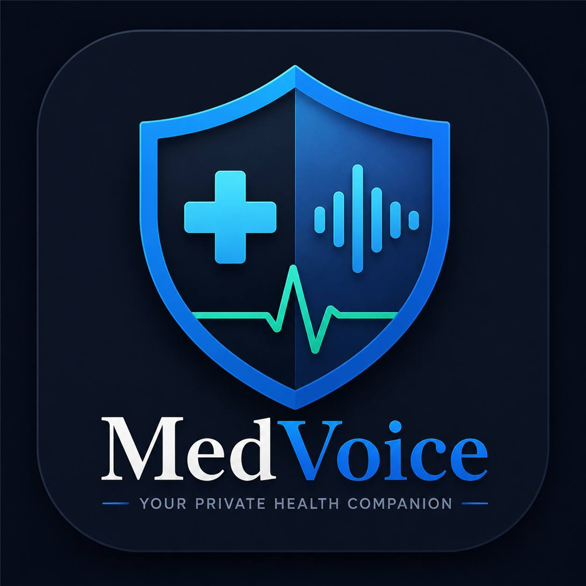

# MedVoice

**A private, on-device AI health companion.**
_Your voice in. Health insight out. Nothing ever leaves your phone._

<p>▶️ &nbsp; <a href="https://www.youtube.com/watch?v=FpOGRjWDFWo"><strong>Watch the Demo</strong></a> &nbsp; · &nbsp; 📥 &nbsp; <a href="https://expo.dev/artifacts/eas/lOHovgiCvXl3OT3qxqa3qc0kSoR8oqAEPlcGfOuEVyw.apk"><strong>Download APK</strong></a> &nbsp; · &nbsp; 🔗 &nbsp; <a href="https://dorahacks.io/buidl/45490"><strong>DoraHacks Submission</strong></a></p>

Built for the **QVAC "Unleash Edge AI" Hackathon** by Tether, on DoraHacks.

</div>

---

## Table of Contents

1. [Project Overview](#1-project-overview)
2. [Problem Statement](#2-problem-statement)
3. [Solution](#3-solution)
4. [Features](#4-features)
5. [Screenshots](#5-screenshots)
6. [Tech Stack](#6-tech-stack)
7. [Architecture](#7-architecture)
8. [Installation](#8-installation)
9. [Device Compatibility](#9-device-compatibility)
10. [AI Usage](#10-ai-usage)
11. [Challenges](#11-challenges)
12. [Future Work](#12-future-work)
13. [Demo Video](#13-demo-video)
14. [Privacy Promise](#14-privacy-promise)
15. [Team & License](#15-team--license)

---

## 1. Project Overview

**MedVoice** is a private, on-device AI health companion that lets anyone track their health **just by talking**. Users speak about how they feel; MedVoice transcribes their voice, analyzes it with an on-device medical AI model, reads the response back aloud, builds a searchable health timeline, and privately shares health summaries with trusted family members over an encrypted peer-to-peer connection.

**Every AI step runs entirely on the device.** No cloud. No API keys. No health data ever leaves the phone — because privacy shouldn't be a feature hidden in settings, it should be the foundation.

> ### The Story Behind MedVoice
>
> When I left home for university, I couldn't stop thinking about my grandmother. Like many elderly people, she often forgot to mention when she wasn't feeling well — headaches for days, dizziness, joint pain — and would simply say, *"I'm fine."* Living hundreds of kilometers away, I worried about the things she wasn't saying.
>
> Existing health apps required typing long notes, sent data to the cloud, or needed accounts and constant internet. None felt designed for someone like her. So I asked a simple question: **"What if all she had to do was talk?"**
>
> That idea became MedVoice — health support that is private, simple, accessible, and always available. Not because we wanted to build another health app, but because the people we care about deserve technology that cares about them too.

---

## 2. Problem Statement

Most health apps send your most sensitive data — symptoms, conditions, medications — to cloud servers. Yet the people who would benefit most from continuous health tracking — the elderly and chronically ill — are often the least comfortable typing detailed logs or trusting Big Tech with their medical history.

The result: critical symptoms go unrecorded, family members far from home have no visibility, and miscommunication leads to poorer health outcomes. Health tracking that demands typing, accounts, subscriptions, and an internet connection simply isn't built for the people who need it most.

---

## 3. Solution

MedVoice lets anyone track their health **by voice alone**, with **every AI step running locally on the device** via the QVAC SDK.

A user speaks how they feel → MedVoice transcribes it on-device → a local medical LLM reasons about it and produces a caring summary, severity, and patterns → the result is read back aloud → it's saved to a searchable health timeline → and important summaries can be privately shared with family, encrypted and peer-to-peer.

No account. No internet required for AI. No data collection. A privacy promise that is **architecturally enforced, not just stated.**

---

## 4. Features

| Feature | What it does | QVAC capability |
|---|---|---|
| 🎙️ **Voice health journaling** | Speak how you feel; live transcription on-device | QVAC Transcription (Parakeet / Whisper) |
| 🧠 **AI health analysis** | Local medical LLM produces a caring summary, severity, tags & patterns | QVAC LLM inference (Qwen3 1.7B / MedGemma 4B) |
| 💬 **Ask MedVoice (AI Q&A chat)** | Conversational chatbot that answers questions about your own history — by voice or text, with the answer spoken back | QVAC LLM + Embeddings (on-device RAG) |
| 📄 **Document Scan** | Photograph a prescription, lab result or doctor's note; on-device OCR reads it and the AI explains it in plain language and aloud | On-device OCR + QVAC LLM + TTS |
| 📋 **Visit Prep** | Generates a doctor-visit brief from your recent entries — what to mention, what to ask, a quick timeline — with read-aloud and share | QVAC LLM |
| 🔊 **Read-aloud responses** | Hears the analysis spoken back — accessibility for elderly users | QVAC Text-to-Speech |
| 🔍 **Semantic health timeline** | Search past entries by meaning, not keywords | QVAC Embeddings + on-device RAG |
| 🌍 **Multi-language** | One setting translates the whole UI (~47 languages), the AI's written replies, and the spoken voice (en/es/de/it) | QVAC NMT (Bergamot) + multilingual TTS |
| 👨‍👩‍👧 **Private family sharing** | Share health summaries device-to-device, encrypted | QVAC Holepunch P2P (HyperDHT) |
| 👁️ **Care View** | Caregivers read a loved one's summaries, read-only | P2P sync |
| 🌗 **Light & dark mode** | Polished, accessible, elderly-friendly UI | — |

**Everything above runs on the phone.** The only network use is Holepunch DHT peer discovery for the P2P handshake — and even that carries **no health data**.

---

## 5. Screenshots

### Onboarding
<div align="center">

| Welcome | Role | Profile |
|:---:|:---:|:---:|
| 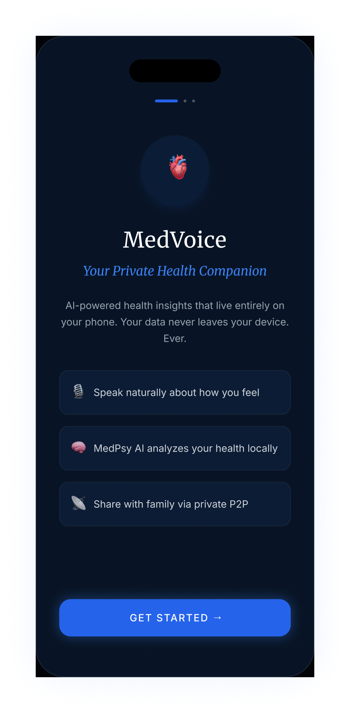 | 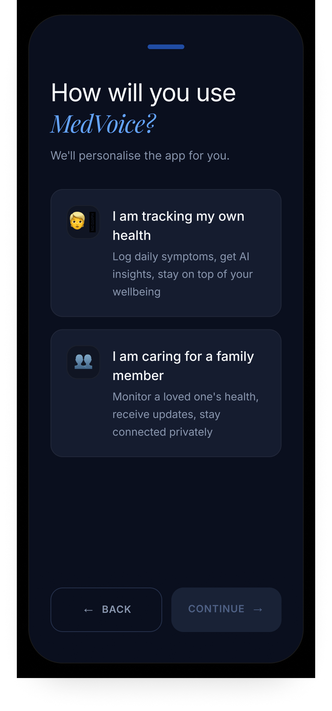 | 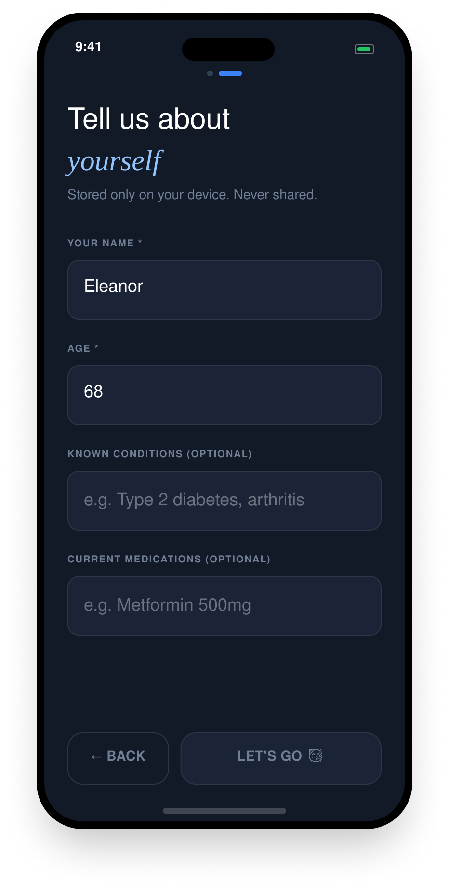 |

</div>

### Core loop — speak → analyze → save
<div align="center">

| Home | Ready to Listen | Recording (live) |
|:---:|:---:|:---:|
| 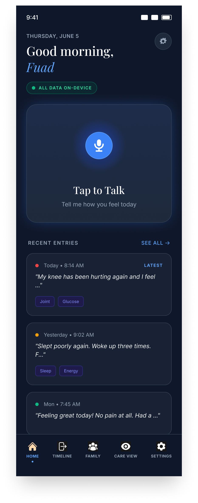 | 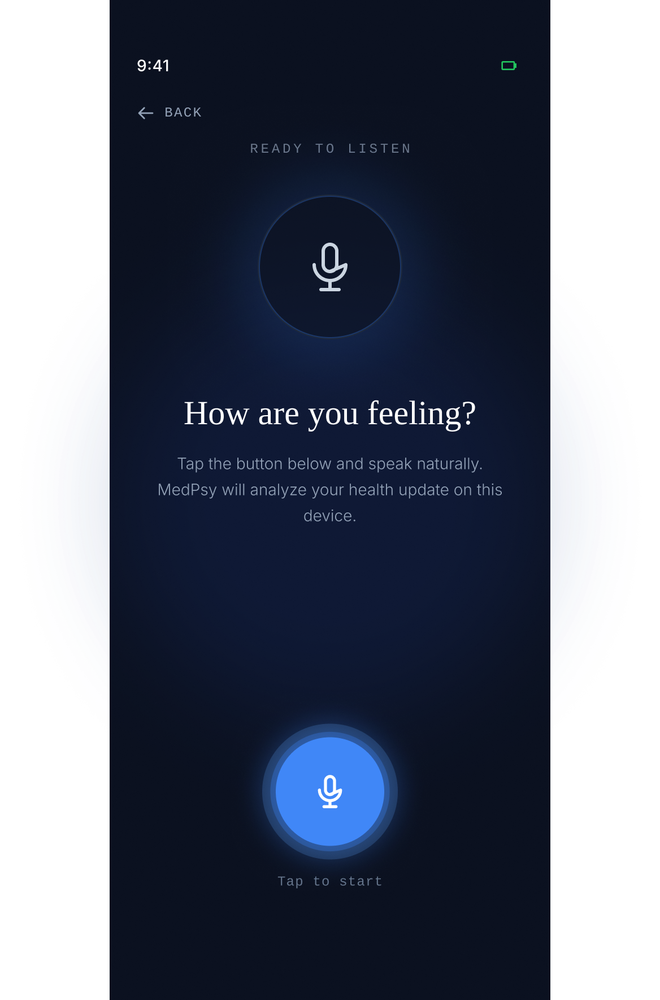 | 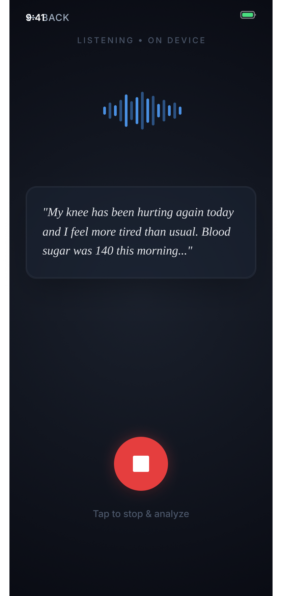 |

| MedPsy Processing | Analysis Result | |
|:---:|:---:|:---:|
| 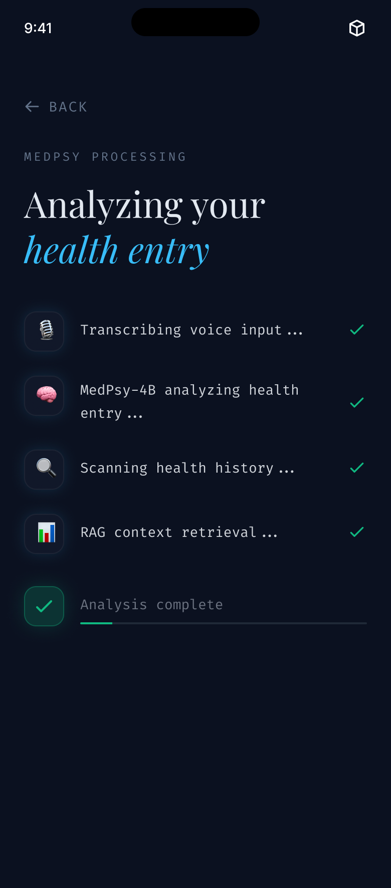 | 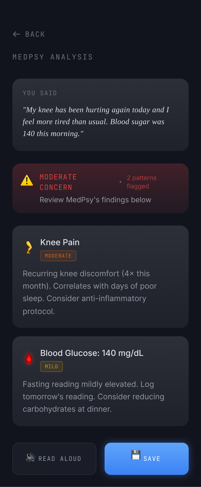 | |

</div>

### Timeline & semantic search
<div align="center">

| Health Timeline | Semantic Search | |
|:---:|:---:|:---:|
| 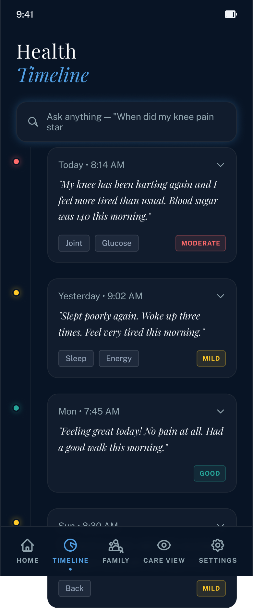 | 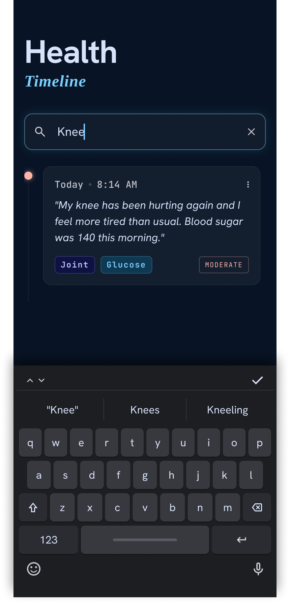 | |

</div>

### Family P2P & Care View
<div align="center">

| Family Connection | Show My Code (QR) | Scan Code |
|:---:|:---:|:---:|
| 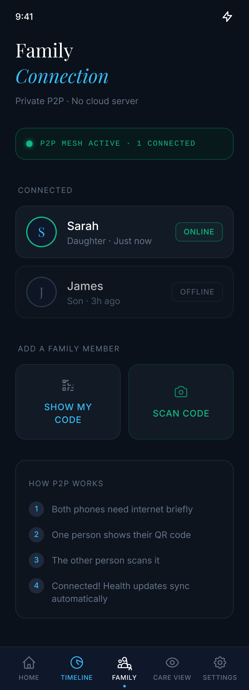 | 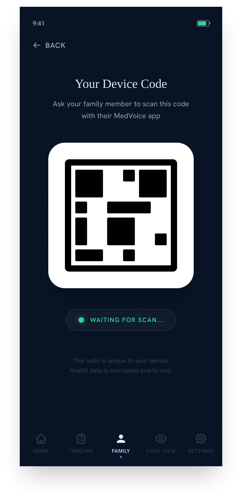 | 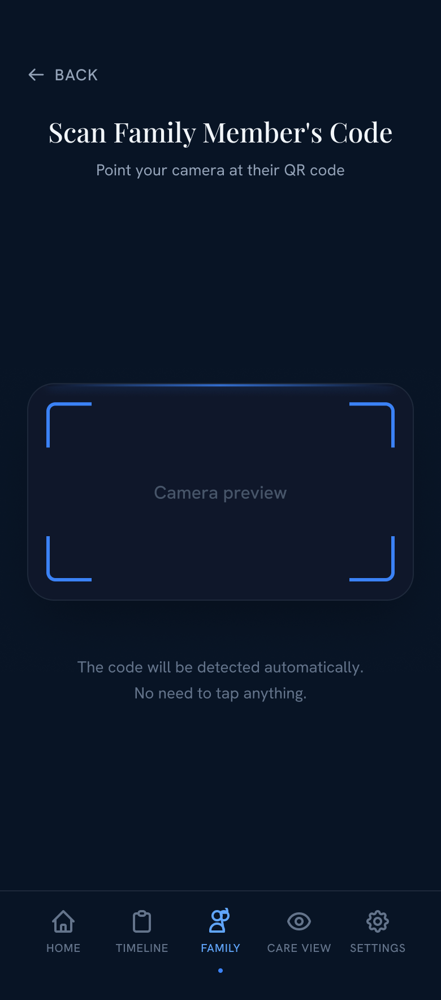 |

| Care View (caregiver) | | |
|:---:|:---:|:---:|
| 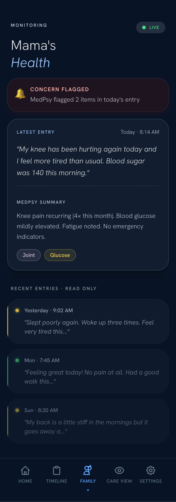 | | |

</div>

### Settings & theming
<div align="center">

| Settings (dark) | Light Mode | Ask MedVoice _(to add)_ |
|:---:|:---:|:---:|
| 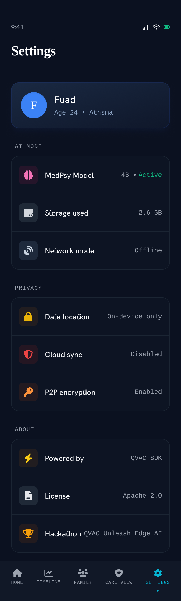 | 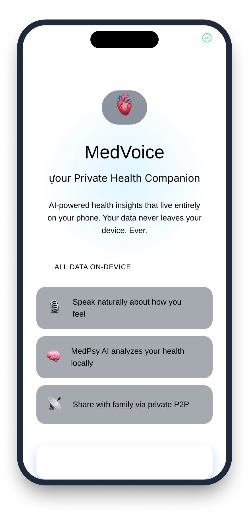 |  |

</div>

> 📸 **Adding / updating screenshots:** drop a PNG into `docs/screenshots/`
> using the file name shown in each cell (e.g. `ask.png`). The image appears
> automatically — no README edits needed. Keep all images the same width so the
> grid stays aligned (the `` tags handle display sizing). To add
> a brand-new screenshot, copy one table cell and change the `src` + caption.
>
> _Still to capture: **Ask MedVoice** chat (`ask.png`), **Document Scan**
> (`scan-doc.png`), and **Visit Prep** (`visit-prep.png`) — these screens exist in
> the app but weren't in the design exports._

---

## 6. Tech Stack

**Frontend / Mobile**
- Expo SDK 56 · React Native 0.85 · TypeScript
- Expo Router (file-based routing)
- NativeWind v5 / Tailwind CSS v4 — light + dark theming

**Edge AI (all on-device, no cloud)**
- [`@qvac/sdk`](https://github.com/tetherto/qvac) `0.12.x` — transcription, LLM, TTS, embeddings, translation
- QVAC Fabric for on-device LLM inference (llama.cpp engine)

**State & Storage (all local)**
- Zustand — global app state
- `expo-sqlite` — health entries & patterns
- AsyncStorage — profile, settings, theme preference

**Native capabilities**
- `expo-audio` — real-time PCM mic capture for live transcription
- `@react-native-ml-kit/text-recognition` — on-device OCR for Document Scan
- `react-native-qrcode-svg` + `expo-camera` — family QR pairing
- `react-native-bare-kit` — Bare worklet hosting the Holepunch P2P node

**Networking**
- QVAC Holepunch (HyperDHT) for peer discovery only — **no health data, no server**

### AI Models (user-selectable in Settings → AI Model)

| Model | Size | Use |
|---|---|---|
| **Qwen3 1.7B** (default) | ~1.1 GB | Smaller download, lower RAM — runs on most devices |
| **MedGemma 4B** | ~2.5 GB | Google's medical Gemma — higher-fidelity summaries |

Models download once on first use and run entirely offline thereafter.

---

## 7. Architecture

```text
┌──────────────────────────── USER'S PHONE (everything runs here) ───────────────────────────┐
│                                                                                             │
│   🎙️  Voice in                                                                              │
│        │                                                                                    │
│        ▼                                                                                    │
│   ┌─────────────────┐   PCM audio   ┌──────────────────────┐   text   ┌──────────────────┐ │
│   │  expo-audio     │ ───────────►  │ QVAC Transcription   │ ───────► │  QVAC LLM        │ │
│   │  (mic capture)  │               │ (Parakeet / Whisper) │          │ (Qwen3 / MedGemma)│ │
│   └─────────────────┘               └──────────────────────┘          └────────┬─────────┘ │
│                                                                                 │           │
│            ┌────────────────────────────────────────────────────────────────────┘           │
│            │ summary · severity · tags · patterns                                            │
│            ▼                                                                                 │
│   ┌──────────────────┐   embeddings   ┌──────────────────┐        ┌──────────────────────┐  │
│   │  QVAC Embeddings │ ─────────────► │  expo-sqlite     │        │  QVAC TTS            │  │
│   │  (RAG search)    │ ◄───────────── │  (health entries)│        │  (read-aloud)  🔊    │  │
│   └──────────────────┘                └──────────────────┘        └──────────────────────┘  │
│                                                                                             │
│   State: Zustand   ·   Settings/Profile/Theme: AsyncStorage                                 │
│                                                                                             │
└──────────────────────────────────────┬──────────────────────────────────────────────────────┘
                                        │  encrypted health summaries (JSON only)
                                        │  via QVAC Holepunch P2P (HyperDHT)
                                        ▼
                          ┌────────────────────────────┐
                          │   FAMILY MEMBER'S PHONE     │
                          │   Care View (read-only)     │
                          └────────────────────────────┘

   ⚠️  The DHT is used ONLY for peer discovery during the handshake.
       No health data ever passes through any server.
```

### Project structure
```text
app/            Expo Router screens (onboarding, tabs, recording, analysis, family)
components/     Reusable UI (cards, badges, waveform, pipeline rows)
lib/            qvac.ts · medpsy.ts · transcription.ts · tts.ts · embeddings.ts · p2p.ts · db.ts
store/          Zustand stores (user, health, family, recording, settings, theme)
constants/      colors.ts (light+dark tokens) · typography.ts · images.ts
p2p/            Bare worklet + bundled Holepunch P2P node
docs/           Documentation assets (screenshots)
types/          Shared TypeScript types
```

### App flow
```text
Onboarding (role · profile · privacy)
      │
      ▼
   HOME  ──tap to talk──►  Recording (ready → active, live waveform + transcript)
      │                          │
      │                          ▼
      │                   Analysis (MedPsy pipeline → result: summary, severity, patterns)
      │                          │  └─ READ ALOUD (TTS) · SAVE TO TIMELINE
      ▼                          ▼
  TIMELINE  ◄── semantic RAG search over saved entries
      │
  FAMILY ──QR pair──► P2P connection ──► CARE VIEW (caregiver, read-only)
      │
  SETTINGS (model selection · theme · profile · privacy)
```
The bottom navigation has 5 tabs: **HOME · TIMELINE · FAMILY · CARE VIEW · SETTINGS**. Beyond the core loop, the **Home** tab also surfaces **Ask MedVoice** (conversational Q&A) and **Document Scan** as cards alongside Tap to Talk, **Visit Prep** is reached from the **Timeline**, and **Settings** holds the app-wide language picker.

---

## 8. Installation

> MedVoice uses native modules (QVAC SDK, Bare P2P worklet, camera, audio). **It requires a development build — it will not run in Expo Go.**

### Prerequisites
- Node.js 18+
- An Android device/emulator (**Android 12+ / API 31 required** for the AI engine — see [Device Compatibility](#9-device-compatibility)) or an iOS device
- ~3 GB free storage on device for the AI models

### Steps
```bash
# 1. Install dependencies
npm install

# 2. (P2P only) bundle the Holepunch worklet
npm run bundle:p2p

# 3. Build & run a development client
npx expo run:android      # or: npx expo run:ios

# 4. Start the dev server (if not already running)
npx expo start --dev-client
```

On first launch, granting microphone permission and selecting an AI model triggers a one-time on-device model download.

### Or just install the APK
Download the prebuilt Android APK directly: [**MedVoice.apk**](https://expo.dev/artifacts/eas/lOHovgiCvXl3OT3qxqa3qc0kSoR8oqAEPlcGfOuEVyw.apk). (You can also browse the [EAS build page](https://expo.dev/accounts/holawale/projects/Medv/builds/366ed81b-675f-45b7-a9b1-36d1f484e177), where you may need to sign in to grab the APK artifact.)

### Quality gates
```bash
npm run lint
npm run typecheck
```

---

## 9. Device Compatibility

> ⚠️ **Android 11 and below cannot use all features.** The on-device AI engine
> (QVAC's llama.cpp) **requires Android 12 (API 31) or newer**. iOS devices are
> fully supported.

The app **degrades gracefully** — it never crashes on older devices — but AI-powered features fall back to simpler alternatives below Android 12:

| Feature | iOS / Android 12+ | Android 11 and below |
|---|---|---|
| Voice journaling (transcription) | ✅ Full | ✅ Works |
| Read-aloud responses (TTS) | ✅ Full | ✅ Works |
| Family sharing (P2P) | ✅ Full | ✅ Works |
| **AI health analysis** | ✅ Full | ⛔ Saves a voice journal entry without AI summary |
| **Ask MedVoice (AI Q&A)** | ✅ Full | ⛔ Falls back to keyword search |
| **Semantic timeline search** | ✅ Full | ⚠️ Keyword search only |

**For the full experience, use an iOS device or an Android phone running Android 12 or later** with ~3 GB free storage.

---

## 10. AI Usage

Every AI capability in MedVoice is powered by the **QVAC SDK** and runs **fully on-device**. Nothing is sent to OpenAI, Google, or any cloud — there are no API keys at all.

| AI capability | Model / engine | Why we chose it | What it does in MedVoice |
|---|---|---|---|
| **Speech-to-text** | QVAC Transcription (Parakeet / Whisper) | Accurate, runs offline, supports real-time streaming | Transcribes the user's spoken health updates live |
| **Medical reasoning** | Qwen3 1.7B (default) or MedGemma 4B | Qwen3 is light enough for most phones; MedGemma is Google's medical-tuned model for higher fidelity | Produces a caring summary, severity, tags & patterns; also powers Ask MedVoice and Visit Prep |
| **Text-to-speech** | QVAC TTS | Natural multilingual voice, on-device | Reads analysis and answers back aloud (accessibility for elderly users) |
| **Embeddings / RAG** | QVAC Embeddings | Enables semantic search without a cloud vector DB | Powers "search by meaning" on the timeline and grounds Ask MedVoice in the user's own history |
| **Translation** | QVAC NMT (Bergamot) | On-device neural machine translation | One setting translates the UI (~47 languages) and the AI's written replies |

> ⚡ **Performance note:** Ask MedVoice pins the analysis model resident across a chat
> session (`pinAnalysisModel` in `lib/qvac.ts`) so multi-turn conversations load it
> once instead of swapping it for the embedding model and back on every message —
> giving noticeably faster follow-up answers, fully on-device.

**Why on-device AI?** Health data is the most sensitive data a person has. Running every model locally means the privacy promise is enforced by architecture, not policy — there is simply no network path for health data to leak.

---

## 11. Challenges

Honest account of what was hard:

- **Real-time transcription needs raw PCM.** The transcription model requires 16 kHz mono PCM; the default recorded `.m4a` won't transcribe. We had to capture raw mic frames via `expo-audio`'s streaming API and feed them live.
- **On-device LLM on real phones.** The QVAC llama.cpp engine requires Android 12+. On older devices it caused a native crash, so we added a `supportsLlamaCppModels()` guard that degrades to a simpler voice-journal / keyword-search mode instead of crashing.
- **Model load/unload latency.** Swapping between the analysis model and the embedding model on every chat message was slow. We solved it by pinning the analysis model resident across a conversation.
- **Peer-to-peer with no server.** Getting encrypted device-to-device sync working over Holepunch HyperDHT — bundled as a Bare worklet via `bare-pack` — required a custom native build pipeline and two physical devices to test.
- **Multi-language without bloat.** Driving the UI, AI replies, and TTS voice from a single language setting (with translation caching) while keeping the bundle small.
- **Storage & memory budget.** Balancing model quality against ~1–2.5 GB downloads and RAM limits on mid-range phones.

---

## 12. Future Work

- 🩺 **Medical terminology optimization** — fine-tune prompts/models for clinical accuracy
- 🌐 **Expanded on-device translation & TTS voices** beyond en/es/de/it
- 👨‍⚕️ **Caregiver dashboard** with trend charts and alerts
- ⌚ **Wearable integration** (heart rate, sleep, activity as additional signals)
- 🔔 **Smart reminders** ("you mentioned headaches 3 days in a row — consider seeing a doctor")
- 📈 **Pattern detection across time** with on-device trend analysis
- 🗣️ **Local-language expansion** for underserved regions

---

## 13. Demo Video

A 2–3 minute walkthrough showing the problem, the solution, a live demo, and the impact.

**▶️ Watch on YouTube:** <https://www.youtube.com/watch?v=FpOGRjWDFWo>

<div align="center">

[](https://www.youtube.com/watch?v=FpOGRjWDFWo)

</div>

---

## 14. Privacy Promise (Non-Negotiable)

- ❌ No cloud database
- ❌ No cloud AI / external inference
- ❌ No external health APIs
- ❌ No analytics or crash reporting that sends data off device
- ✅ Health entries stored locally in **SQLite**
- ✅ Profile / settings / theme in **AsyncStorage**
- ✅ All AI inference on-device via **QVAC SDK**
- ✅ Family sharing is **encrypted, peer-to-peer**, server-free

---

## 15. Team & License

**Team**
- **Ajibade Muhammod** — Developer — GitHub [@muhaj-dev](https://github.com/muhaj-dev) · DoraHacks [@muhaj](https://dorahacks.io/hacker/Muhaj)
- **Adeshina Fuad** — Designer · DoraHacks [@leadui](https://dorahacks.io/hacker/Leadui)

**License**

Released under the [MIT License](./LICENSE).

---

<div align="center">

*Built with ❤️ and zero cloud calls using the QVAC SDK by Tether.*

</div>
